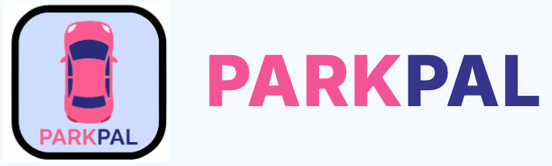

# ParkPal App



[Parkpal slide deck](https://docs.google.com/presentation/d/15-vk-3Y4ljg8ydnZkl3E0ZrwzirzI3DpIPLJgMz2WcE/)

ParkPal is a split client/server app:

- `client/`: Next.js frontend
- `server/`: Express + TypeScript API

## Requirements

- Node.js
- npm

## Local setup

### 1. Server

```bash
cd server
npm install
cp .env.example .env
npm run dev
```

Server default URL:

```text
http://localhost:8080
```

### 2. Client

Open a second terminal:

```bash
cd client
npm install
cp .env.example .env
npm run dev
```

Client default URL:

```text
http://localhost:3000
```

Client env file:

```bash
cd client
cp .env.example .env
```

Set:

```env
NEXT_PUBLIC_SOLANA_RPC_URL="your-solana-rpc-url"
```

## Build and start

### Server

```bash
cd server
npm run build
npm start
```

### Client

```bash
cd client
npm run build
npm start
```

## Server env file

`server/.env` can be created from `server/.env.example`:

```bash
cd server
cp .env.example .env
```

Relevant defaults:

```env
CLIENT_URL="http://localhost:3000"
SERVER_URL="http://localhost:8080"
SERVER_PORT=8080
```
